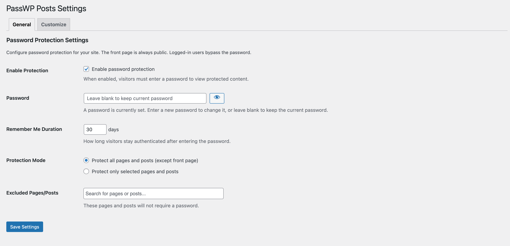
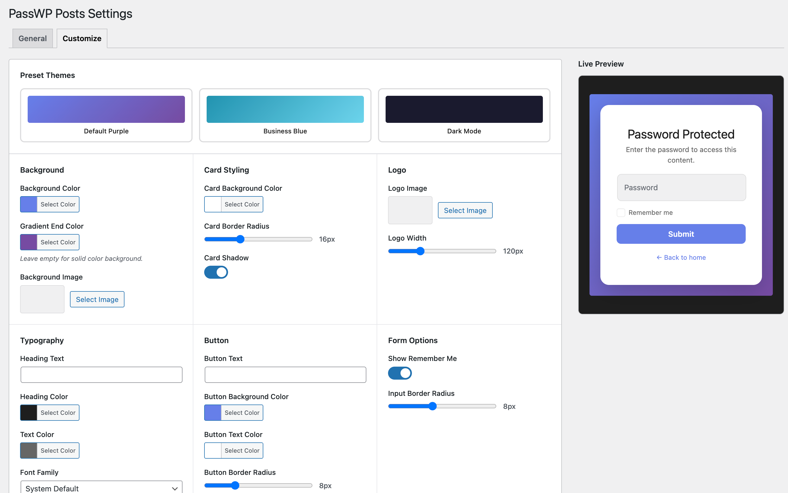

# PassWP Posts

A simple password protection plugin for WordPress—no usernames, no accounts, just one shared password. Share the password with those who need access and they're in. Perfect for situations where you need quick, hassle-free access control without user management.

## When to Use This Plugin

PassWP Posts is ideal when you need **simple shared access** without the overhead of user accounts:

- **Staging Sites** — Share a password with clients to preview their site before launch
- **Client Portals** — Protect project documentation or deliverables with a single password
- **Pre-launch Sites** — Keep your "Coming Soon" site private while you finish development
- **Private Blogs** — Share personal content with family or friends using one easy password
- **Internal Resources** — Protect company wikis or documentation from public access
- **Event Websites** — Limit access to event details, schedules, or member areas
- **Photography Galleries** — Share client proofs with a simple password (no login required)
- **Educational Content** — Protect course materials for a class or workshop

> **Note:** This is NOT a membership or user management plugin. If you need individual user accounts, different access levels, or tracking who accessed what, use a membership plugin instead.

## Features

- **One Password, No Username** — Visitors just enter the password—no account creation, no login forms
- **Front Page Always Public** — Your homepage remains accessible to everyone
- **Logged-in User Bypass** — WordPress users (editors, admins) skip the password prompt
- **Flexible Protection** — Protect all content (with exclusions) or only selected pages/posts
- **Customizable Form** — Match your brand with colors, typography, logo, and preset themes
- **Remember Me** — Visitors stay authenticated for a configurable duration
- **Secure** — Uses WordPress-native password hashing and secure cookies


## Installation


- Download [`passwp-posts.zip`](https://github.com/soderlind/passwp-posts/releases/latest/download/passwp-posts.zip)
- Upload via  Plugins > Add New > Upload Plugin
- Activate the plugin.


Plugin [updates are handled automatically](https://github.com/soderlind/wordpress-plugin-github-updater#readme) via GitHub. No need to manually download and install updates.

## Configuration

Go to **Settings → PassWP Posts** to configure the plugin.

### General Settings



<table width="100%">
  <thead>
    <tr>
      <th align="left">Setting</th>
      <th align="left">Description</th>
    </tr>
  </thead>
  <tbody>
    <tr>
      <td><strong>Enable Protection</strong></td>
      <td>Toggle password protection on/off</td>
    </tr>
    <tr>
      <td><strong>Password</strong></td>
      <td>The password visitors must enter to access protected content</td>
    </tr>
    <tr>
      <td><strong>Remember Me Duration</strong></td>
      <td>Number of days to remember the password (default: 30)</td>
    </tr>
    <tr>
      <td><strong>Protection Mode</strong></td>
      <td>Choose to protect all pages/posts or only selected ones</td>
    </tr>
    <tr>
      <td><strong>Excluded Pages/Posts</strong></td>
      <td>When protecting all: select pages/posts to exclude</td>
    </tr>
    <tr>
      <td><strong>Protected Pages/Posts</strong></td>
      <td>When protecting selected: choose which pages/posts to protect</td>
    </tr>
  </tbody>
</table>

### Customize Settings



<table width="100%">
  <thead>
    <tr>
      <th align="left">Setting</th>
      <th align="left">Description</th>
    </tr>
  </thead>
  <tbody>
    <tr>
      <td><strong>Preset Themes</strong></td>
      <td>Quick-apply themes: Default Purple, Business Blue, Dark Mode</td>
    </tr>
    <tr>
      <td><strong>Background</strong></td>
      <td>Background color, gradient, and optional background image</td>
    </tr>
    <tr>
      <td><strong>Card Styling</strong></td>
      <td>Card background color, border radius, and shadow</td>
    </tr>
    <tr>
      <td><strong>Logo</strong></td>
      <td>Upload a custom logo with adjustable width</td>
    </tr>
    <tr>
      <td><strong>Typography</strong></td>
      <td>Heading text, colors, and font family</td>
    </tr>
    <tr>
      <td><strong>Button</strong></td>
      <td>Button text, colors, and border radius</td>
    </tr>
    <tr>
      <td><strong>Form Options</strong></td>
      <td>Show/hide "Remember Me" checkbox, input border radius</td>
    </tr>
    <tr>
      <td><strong>Footer</strong></td>
      <td>Custom footer text and link URL</td>
    </tr>
  </tbody>
</table>

## How It Works

1. When a visitor tries to access a protected page or post, they are shown a password form
2. If they enter the correct password, a secure cookie is set
3. The cookie allows them to browse freely for the configured duration
4. Logged-in users are never prompted for a password (**use incognito or private browsing mode to test protection**).
5. The front page is always public regardless of protection mode

## Security

- Passwords are stored using `wp_hash_password()` (same as WordPress user passwords)
- Cookies contain a SHA256 hash of the password hash combined with `wp_salt('auth')`
- All form submissions are protected with WordPress nonces
- Admin actions require `manage_options` capability

## Development

### Requirements

- PHP 8.3+
- WordPress 6.8+

### Running Tests

**PHP Tests (PHPUnit with Brain\Monkey):**

```bash
composer install
composer test
```

**JavaScript Tests (Vitest):**

```bash
npm install
npm test
```

### Building Translations

```bash
# Generate POT file
wp i18n make-pot . languages/passwp-posts.pot

# Generate MO file from PO
wp i18n make-mo languages/passwp-posts-nb_NO.po

# Generate PHP translation file (WordPress 6.5+)
wp i18n make-php languages
```

## Directory Structure

```
passwp-posts/
├── assets/
│   ├── css/
│   │   ├── admin.css
│   │   ├── customize-admin.css
│   │   └── password-form.css
│   ├── js/
│   │   ├── admin.js
│   │   └── customize.js
│   └── vendor/
│       └── select2/
├── includes/
│   ├── class-admin-settings.php
│   ├── class-cookie-handler.php
│   └── class-protection.php
├── languages/
│   ├── passwp-posts.pot
│   ├── passwp-posts-nb_NO.po
│   ├── passwp-posts-nb_NO.mo
│   └── passwp-posts-nb_NO.l10n.php
├── templates/
│   └── password-form.php
├── tests/
│   ├── js/
│   └── php/
├── passwp-posts.php
├── composer.json
├── package.json
└── README.md
```

## Hooks

### Filters

```php
// Modify the password form template path
add_filter( 'passwp_posts_form_template', function( $template ) {
    return get_stylesheet_directory() . '/passwp-posts-form.php';
});
```

## Translations

The plugin is translation-ready with the text domain `passwp-posts`. Available translations:

- English (default)
- Norwegian Bokmål (nb_NO)

## License

GPL v2 or later

## Changelog

See [CHANGELOG.md](CHANGELOG.md) for a detailed list of changes.
